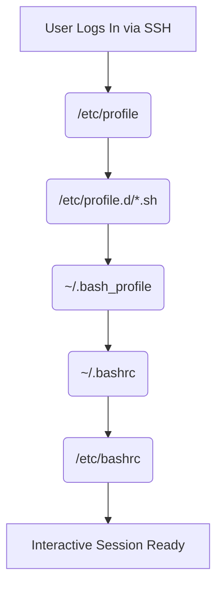

### Linux Access Control

Linux enforces security through user definitions, default operational profiles, discretionary access controls (DAC), and extended attributes.

### Core Permissions

| Access Right | File Execution Property | Directory Execution Property | Octal Value |
| :--- | :--- | :--- | :--- |
| **Read (`r`)** | View content data (`cat`, `less`) | Enumerate names (`ls`) | `4` |
| **Write (`w`)** | Modify content data (`vi`, `echo`) | Add, delete, rename internal items | `2` |
| **Execute (`x`)** | Execute program binaries / scripts | Traverse into target path (`cd`) | `1` |

### Special Directory Permission
* **Read-only (`r--`, 4):** Allows downloading file name strings, but blocks reading file metadata (size, type, owner). Attempts to list contents yield an active array of `?` markers.
* **Execute-only (`--x`, 1):** Allows entry into the target folder via `cd`, but prevents listing the contents inside. Users must know the exact filename to open or interact with it.

### Special Permissions

Production runtimes use three specific bits to enable secure resource sharing and elevation workflows.

```shadow
  Type   | Octal Value | Code Location  | Functional Production Result
---------|-------------|----------------|----------------------------------------------
  SUID   |     4       | User Position  | Executable runs with file owner privileges
  SGID   |     2       | Group Position | New items inherit parent folder's GID group
  Sticky |     1       | Other Position | Only item owner or root can delete the file
```

### Capitalized Flag Status (`S` / `T`)
* **Lowercase (`s`, `t`):** Indicates the special attribute is valid and working.
* **Uppercase (`S`, `T`):** Indicates a configuration error. The special flag is set, but the underlying execution right (`x`) is missing. This renders the special privilege completely inactive.

### Identity & System Groups

The system segregates processes and user execution rings using unique numerical identifiers (**UID** / **GID**). These parameters are managed inside `/etc/passwd` and `/etc/group`.

#### User Types and UIDs

| Type of User | Description | UID Range |
| :--- | :--- | :--- |
| **Root User** | Superuser with absolute administrative privileges | `0` |
| **System Users** | Daemons and background services | `1–200` |
| **App Users** | Dedicated application runtimes | `201–999` |
| **Normal Users** | Standard human user accounts | `>=1000` |

#### Group Types and GIDs

| Type of Group | Description | GID Range |
| :--- | :--- | :--- |
| **Root Group** | Primary group for the root superuser | `0` |
| **System Groups** | Groups associated with system daemons and services | `1–200` |
| **App Groups** | Groups tied to dedicated application runtimes | `201–999` |
| **Normal Groups** | Primary and secondary groups for standard human users | `>=1000` |

*Note: The primary user of a group is implicitly mapped via `/etc/passwd` and remains hidden in the `/etc/group` file view.*


---
### Umask & The Bitwise Permission

The system **umask** filters out unwanted privileges at file or directory creation.
By default, security rules prevent any file from receiving execution rights (`x`) at initialization.

* **Max File Initialization Potential:** `666` (`rw-rw-rw-`)
* **Max Directory Initialization Potential:** `777` (`rwxrwxrwx`)

### Calculation Rule
Do not use simple subtraction to calculate your umask. If the umask features an odd numeric assignment, standard subtraction yields inaccurate permission states.
The OS applies a strict **Bitwise AND NOT** operation instead.

$$\text{Final Permissions} = \text{Max Potential} \cap \neg\text{Umask}$$

- (Umask 023 Example)
```binary
Max File Matrix:       666 --> 110 110 110
Active System Umask:   023 --> 000 010 011  
----------------------------------------
NOT Umask Masking:     ~023 --> 111 101 100
Result (Bitwise AND):           110 100 100 --> 644 (rw-r--r--)
```
---

### Shell Initialization Sequences

When an infrastructure shell boots up, configuration settings are evaluated in a specific, immutable order. **User-level configuration options override system-wide policies.**



### Configuration Placement Rules
* **System-Wide Adjustments (`/etc/bashrc`):** Use this path to apply global configuration settings across all user accounts on the host infrastructure.
* **User-Specific Tweaks (`~/.bashrc`):** Use this path to store local configuration profiles. These modifications override global system settings.
* **Session Cleanup Operations (`~/.bash_logout`):** Use this file to trigger automated cleanup processes when a user logs out, such as wiping temporary keys or purging session screen cache.

---

### Advanced Granular Control via Access Control Lists (ACLs)
When complex environments require mapping a file to miltiple distinct users or groups, standard discretionary access systems break down. To resolve this, use ACL structures.
A trailing plus character (**`+`**) on an intem's permission string indicates that an extended ACL profile is active.
```bash
-rw-rwxr--+ 1 root root 242 Mar 25 12:00 deployment.log
```

---

### Immutable File Lockdowns (System Hardening)
To secure mission-critical production directories against unauthorized alterations—even by the root account—manage the secondary system attributes.

```bash
# Lock a file down completely (Prevents deletion, editing, or renaming)
chattr +i /etc/resolv.conf

# Configure an audit log to be append-only (Allows data entry, blocks deletions)
chattr +a /var/log/custom_audit.log

# View active system attribute profiles
lsattr /etc/resolv.conf
```

### Terminal Session
```
# File Permission and Access Control Management

	# Type of users                              UID

	  # 1. Root User (Superuser)                  0
	  # 2. System Users (Daemons/Services)       1-200
	  # 3. App Users (Dedicated Runtimes)       201-999
	  # 4. Normal Users (Human Accounts)        >=1000

	# Type of groups                             GID

	  # 1. Root user's group                      0
	  # 2. System Users group                    1-200
	  # 3. App Users' group                      201-999
	  # 4. Normal Users group                    >=1000

[aadarsha@labserver ~]$ cat /etc/passwd
root:x:0:0:Super User:/root:/bin/bash
bin:x:1:1:bin:/bin:/usr/sbin/nologin
daemon:x:2:2:daemon:/sbin:/usr/sbin/nologin
...
aadarsha:x:1000:1000:Aadarsha Khadka:/home/aadarsha:/bin/bash
user1:x:1003:1003::/home/user1:/bin/bash
user2:x:1004:1004::/home/user2:/bin/bash
[aadarsha@labserver ~]$

[aadarsha@labserver ~]$ tail -5 /etc/passwd
aadarsha:x:1000:1000:Aadarsha Khadka:/home/aadarsha:/bin/bash
suman:x:1001:1001::/home/suman:/bin/bash
milan:x:1002:1002::/home/milan:/bin/bash
user1:x:1003:1003::/home/user1:/bin/bash
user2:x:1004:1004::/home/user2:/bin/bash

 # Database structure of /etc/passwd
 
	# <username>:x(password):<UID>:<GID>::(<comment>):<home dir>:<shell>
	
	# <username>:x(password):<UID>:<GID>::(<comment>):<home dir>:<shell>

[aadarsha@labserver ~]$ rpm -q httpd
package httpd is not installed

[aadarsha@labserver ~]$ su - root
Password: 

[root@labserver ~]# yum -y install httpd
...
[root@labserver ~]# rpm -q httpd
httpd-2.4.63-13.el10.x86_64

[root@labserver ~]# grep apache /etc/passwd
apache:x:48:48:Apache:/usr/share/httpd:/sbin/nologin

[aadarsha@labserver ~]$ whoami
aadarsha

[aadarsha@labserver ~]$ su - root

[root@labserver ~]# cat /etc/passwd
root:x:0:0:Super User:/root:/bin/bash
bin:x:1:1:bin:/bin:/usr/sbin/nologin
daemon:x:2:2:daemon:/sbin:/usr/sbin/nologin
...
aadarsha:x:1000:1000:Aadarsha Khadka:/home/aadarsha:/bin/bash
suman:x:1001:1001::/home/suman:/bin/bash
milan:x:1002:1002::/home/milan:/bin/bash
user1:x:1003:1003::/home/user1:/bin/bash
user2:x:1004:1004::/home/user2:/bin/bash
apache:x:48:48:Apache:/usr/share/httpd:/sbin/nologin
[root@labserver ~]# 

[root@labserver ~]# cat /etc/group
root:x:0:
bin:x:1:
daemon:x:2:
sys:x:3:D of /
...
systemd-coredump:x:995:
aadarsha:x:1000:
suman:x:1001:
milan:x:1002:
user1:x:1003:
user2:x:1004:
apache:x:48:
[root@labserver ~]#

[root@labserver ~]# useradd sima

[root@labserver ~]# passwd sima
New password: 
Retype new password: 
passwd: password updated successfully
[root@labserver ~]# 

[root@labserver ~]# cat /etc/passwd
root:x:0:0:Super User:/root:/bin/bash
...
sima:x:1005:1005::/home/sima:/bin/bash
[root@labserver ~]# 

[root@labserver ~]# cat /etc/group
root:x:0:
...
sima:x:1005:
[root@labserver ~]# 

# Types of groups

  # 1. Primary group
  # 2. Secondary group

# 1. Primary group (Mandatory --> each user has a primary group)
# 2. Secondary group (Optional)

[root@labserver ~]# tail -3 /etc/group
user2:x:1004:
apache:x:48:
sima:x:1005:
[root@labserver ~]# 

# primary group is assigned a name same as user name by default 

[root@labserver ~]# tail -3 /etc/group
user2:x:1004:
apache:x:48:
sima:x:1005:
[root@labserver ~]# 

# format of /etc/group

# <group-name>:x(password):<GID>: users (primary user is hidden) for eg: sima is hidden in (sima:x:1005: )

# password for users exist in file  ---> cat /etc/shadow

[root@labserver ~]# cat /etc/shadow
root:$y$j9T$xHwjHrmsH4/sp62As3eE8bHB$CwQ0bGTIi1ehU4oeMhbRX8E.5YbCJgUxSeazFAxh1q/::0:99999:7:::
bin:*:20186:0:99999:7:::
daemon:*:20186:0:99999:7:::
...
chrony:!:20599::::::
systemd-coredump:!*:20599::::::
aadarsha:$y$j9T$obRuZ4304azSixvHlfBTNl9N$zhF91IWpfwj.lLrH4LGrGZNNt8dGRTfKnzOyDNqNkX7::0:99999:7:::
suman:$y$j9T$7AODYF0LFq9aC2XK7RkTa1$QRsBJu.4yuPz2E6uaVsH4WUsxeB2cPQsYFPi77XnAI6:20619:0:99999:7:::
milan:$y$j9T$7kuVLa3q32wOz1rE4XVYi.$KS8ZM5hcJI9ZcHznzCU/uPBr9rJ5bnrryag5oR3TsMD:20619:0:99999:7:::
user1:$y$j9T$QuQXx9tw9Y.3c6/zUycbI.$rutoU2GiuC20OC.XNNXKSBHTpY8vQmKc8n5ygAOAP39:20619:0:99999:7:::
user2:!:20619:0:99999:7:::
apache:!:20619::::::
sima:$y$j9T$5Q7Xya0gUOf619bhxe.Ae0$hMhERRPD3IBfRd1/c.xOWwM9NwCzkIYFLUyD/PSlNyD:20619:0:99999:7:::
[root@labserver ~]# 

 # Default hashing algorithm SHA512

[root@labserver ~]# whoami
root

# Viewing the details of the currently logged in users

[root@labserver ~]# users
aadarsha aadarsha

[root@labserver ~]# who
aadarsha tty1         2026-06-16 05:08
aadarsha pts/0        2026-06-16 05:08 (192.168.1.98)

[root@labserver ~]# exit
logout

[aadarsha@labserver ~]$ su - root
Password: 
Last login: Tue Jun 16 05:09:49 +0545 2026 on pts/0
[root@labserver ~]# 

[root@labserver ~]# who
aadarsha tty1         2026-06-16 05:08
aadarsha pts/0        2026-06-16 05:08 (192.168.1.98)
sima     pts/1        2026-06-16 05:24 (192.168.1.98)
[root@labserver ~]# 

[root@labserver ~]# w
 05:29:35 up 22 min,  3 users,  load average: 0.05, 0.03, 0.00
USER     TTY        LOGIN@   IDLE   JCPU   PCPU WHAT
aadarsha tty1      05:08   21:22   0.02s  0.02s -bash
aadarsha           05:08   22:04   0.00s  0.03s sshd-session: aadarsha [priv]
sima               05:24   22:04   0.00s  0.03s sshd-session: sima [priv]
[root@labserver ~]# 

# information about the range of users, customize: in /etc/login.defs  and /etc/default/useradd 

 # Permissions:
   # Types of Permissions
   # 1. General Permission
   # 2. Special Permission


 # 1. General Permission

 #   Permission Type   |   Symbolic Representation   |   Numeric Representation 
 #  ----------------------------------------------------------------------------
 #   Read              |     r                       |        4
 #   Write             |     w                       |        2
 #   Execute           |     x                       |        1
 #   No Permission     |     -                       |        0
 #   Full Permission   |     rwx                     |        7

 
 # Meaning/Effect of Permission on a File/Directory
 
 # Permission        |    Effect on a File                                            |    Effect on a Directory
 #----------------------------------------------------------------------------------------------------------------
 # Read (r-4)        |  It allows to view the content of file (cat, less,...)         | 


# ___fill___   ???

[root@labserver ~]# exit
logout 

[aadarsha@labserver ~]$ cd /etc

[aadarsha@labserver etc]$ pwd
/etc

[aadarsha@labserver etc]$ cd

[aadarsha@labserver ~]$ 

[aadarsha@labserver ~]$ cd /root
-bash: cd: /root: Permission denied
[aadarsha@labserver ~]$ 

# there is no execute permission in root for current user in root directory

[aadarsha@labserver ~]$ ls
dir1  dira  extracted  testcompany  testfile  words

[aadarsha@labserver ~]$ touch file1 file2

[aadarsha@labserver ~]$ ls
dir1  dira  extracted  file1  file2  testcompany  testfile  words

# Viewing Permission on a File/Dir

[aadarsha@labserver ~]$ ls -l
total 4844
drwxr-xr-x. 3 aadarsha aadarsha      33 Jun  8 06:47 dir1
drwxr-xr-x. 3 aadarsha aadarsha      65 Jun  8 12:07 dira
drwxr-xr-x. 4 root     root          28 Jun  8 20:16 extracted
-rw-r--r--. 1 aadarsha aadarsha       0 Jun 16 05:53 file1
-rw-r--r--. 1 aadarsha aadarsha       0 Jun 16 05:53 file2
drwxr-xr-x. 5 aadarsha aadarsha      54 Jun  7 07:24 testcompany
-rw-r--r--. 1 aadarsha aadarsha      56 Jun  7 21:33 testfile
-rw-r--r--. 1 aadarsha aadarsha 4953598 Jun  8 09:52 words
[aadarsha@labserver ~]$ 

 # first field: ----------
 
 #  -         ---          ---            ---
 # Type      Owner        Group          Others
 #         Permission   Permission     Permission

 # Type
  # d --> directory
  # - --> normal file
  # l --> soft link
 
 # first field: ----------.
 # . ---> ACL
 
 # permission string: 9 characters

[aadarsha@labserver ~]$ ls -l words 
-rw-r--r--. 1 aadarsha aadarsha 4953598 Jun  8 09:52 words

[aadarsha@labserver ~]$ ls -ld
drwx------. 6 aadarsha aadarsha 4096 Jun 16 05:53 .

[aadarsha@labserver ~]$ ls -ldh
drwx------. 6 aadarsha aadarsha 4.0K Jun 16 05:53 .

 # Changing permission of a file/dir

[aadarsha@labserver ~]$ whoami
aadarsha

[aadarsha@labserver ~]$ vi file1

[aadarsha@labserver ~]$ mkdir dir2

[aadarsha@labserver ~]$ cd dir2

[aadarsha@labserver dir2]$ 

[aadarsha@labserver dir2]$ touch file1
[aadarsha@labserver dir2]$ vi file1 

[aadarsha@labserver dir2]$ cd

[aadarsha@labserver ~]$ ls -l file1
-rw-r--r--. 1 aadarsha aadarsha 26 Jun 16 06:08 file1

 # Changing Permission of a File/Dir
  # Method-I: Symbolic Method
   # chmod u=rwx, g=rw, o= in file1
   # chmod u+x, g+w, o-r file1
 
[aadarsha@labserver ~]$ chmod u=rwx,g=rw,o= file1

[aadarsha@labserver ~]$ ls -lh file1
-rwxrw----. 1 aadarsha aadarsha 26 Jun 16 06:08 file1

[aadarsha@labserver ~]$ ls
dir1  dir2  dira  extracted  file1  file2  testcompany  testfile  words

[aadarsha@labserver ~]$ ls -lh file2
-rw-r--r--. 1 aadarsha aadarsha 0 Jun 16 05:53 file2

   # Method-II: Numeric Method

    # chmod u=rwx,g=rw,o= file2
 
    # chmod 760 file2

[aadarsha@labserver ~]$ ls -lh file2
-rw-r--r--. 1 aadarsha aadarsha 0 Jun 16 05:53 file2

[aadarsha@labserver ~]$ chmod 760 file2

[aadarsha@labserver ~]$ ls -lh file2
-rwxrw----. 1 aadarsha aadarsha 0 Jun 16 05:53 file2 

  # chmod u=rx,g=rx,o=rx file1
  
    # chmod ugo=rx file1
    
    # chmod 555 file1
 
    # chmod 444 file1 file2

[aadarsha@labserver ~]$ chmod 555 file1

[aadarsha@labserver ~]$ ls -lh file1
-r-xr-xr-x. 1 aadarsha aadarsha 26 Jun 16 06:08 file1

[aadarsha@labserver ~]$ chmod 444 file1 file2

[aadarsha@labserver ~]$ ls -lh
...
-r--r--r--. 1 aadarsha aadarsha   26 Jun 16 06:08 file1
-r--r--r--. 1 aadarsha aadarsha    0 Jun 16 05:53 file2
...
[aadarsha@labserver ~]$ 
 
[aadarsha@labserver ~]$ ls -lh file1 file2
-r--r--r--. 1 aadarsha aadarsha 26 Jun 16 06:08 file1
-r--r--r--. 1 aadarsha aadarsha  0 Jun 16 05:53 file2

 # ugo or a same --> all ( owner, user, others)

[aadarsha@labserver ~]$ chmod a+x file1 file2

[aadarsha@labserver ~]$ ls -lh file1 file2
-r-xr-xr-x. 1 aadarsha aadarsha 26 Jun 16 06:08 file1
-r-xr-xr-x. 1 aadarsha aadarsha  0 Jun 16 05:53 file2

[aadarsha@labserver ~]$ chmod go-x file2

[aadarsha@labserver ~]$ ls -lh file1 file2
-r-xr-xr-x. 1 aadarsha aadarsha 26 Jun 16 06:08 file1
-r-xr--r--. 1 aadarsha aadarsha  0 Jun 16 05:53 file2

[aadarsha@labserver ~]$ ls -ld dir2
drwxr-xr-x. 2 aadarsha aadarsha 19 Jun 16 06:09 dir2
 
[aadarsha@labserver ~]$ chmod 700 dir2

[aadarsha@labserver ~]$ ls -ld dir2
drwx------. 2 aadarsha aadarsha 19 Jun 16 06:09 dir2

 # chmod -R 700 dir2 (recursive --> -R)

[aadarsha@labserver ~]$ cd dir2

[aadarsha@labserver dir2]$ ls
file1

[aadarsha@labserver dir2]$ ls -l file1 
-rw-r--r--. 1 aadarsha aadarsha 34 Jun 16 06:09 file1

[aadarsha@labserver dir2]$ cd

[aadarsha@labserver ~]$ chmod -R 700 dir2

[aadarsha@labserver ~]$ ls -l dir2
total 4
-rwx------. 1 aadarsha aadarsha 34 Jun 16 06:09 file1

[aadarsha@labserver ~]$ cd dir2

[aadarsha@labserver dir2]$ ls -l file1
-rwx------. 1 aadarsha aadarsha 34 Jun 16 06:09 file1

 # all the inside files and directories get the same permission using -R

[aadarsha@labserver ~]$ ls -l file1 file2
-r-xr-xr-x. 1 aadarsha aadarsha 26 Jun 16 06:08 file1
-r-xr--r--. 1 aadarsha aadarsha  0 Jun 16 05:53 file2

 # Verifying Effects of Permissions on a File

[aadarsha@labserver ~]$ ls -l file1
-r-xr-xr-x. 1 aadarsha aadarsha 26 Jun 16 06:08 file1

[aadarsha@labserver ~]$ chmod 000 file1

[aadarsha@labserver ~]$ ls -l file1
----------. 1 aadarsha aadarsha 26 Jun 16 06:08 file1

[aadarsha@labserver ~]$ cat file1
cat: file1: Permission denied

[aadarsha@labserver ~]$ chmod u+r file1

[aadarsha@labserver ~]$ ls -l file1
-r--------. 1 aadarsha aadarsha 26 Jun 16 06:08 file1

[aadarsha@labserver ~]$ cat file1
this is the first file...

[aadarsha@labserver ~]$ chmod u=w file1

[aadarsha@labserver ~]$ ls -l file1
--w-------. 1 aadarsha aadarsha 26 Jun 16 06:08 file1

 # read also removed when using =
 
[aadarsha@labserver ~]$ chmod u+rw file1

[aadarsha@labserver ~]$ ls -l file1
-rw-------. 1 aadarsha aadarsha 26 Jun 16 06:08 file1

[aadarsha@labserver ~]$ cat file1
this is the first file...

[aadarsha@labserver ~]$ vi file1

[aadarsha@labserver ~]$ cat file1
this is the first file...
this is added line

 # Verifying effects of permissions on a dir
 
[aadarsha@labserver ~]$ ls -ld dir2
drwx------. 2 aadarsha aadarsha 19 Jun 16 06:09 dir2

[aadarsha@labserver ~]$ chmod 000 dir2

[aadarsha@labserver ~]$ ls -ld dir2
d---------. 2 aadarsha aadarsha 19 Jun 16 06:09 dir2
 
[aadarsha@labserver ~]$ cd dir2
-bash: cd: dir2: Permission denied
 
[aadarsha@labserver ~]$ whoami
aadarsha
 
 # there is no execute permissions on the directory

[aadarsha@labserver ~]$ chmod u+x dir2

[aadarsha@labserver ~]$ ls -ld dir2
d--x------. 2 aadarsha aadarsha 19 Jun 16 06:09 dir2
 
[aadarsha@labserver ~]$ cd dir2

[aadarsha@labserver dir2]$ ls
ls: cannot open directory '.': Permission denied
 
[aadarsha@labserver dir2]$ chmod u+r ../dir2

[aadarsha@labserver dir2]$ pwd
/home/aadarsha/dir2
 
[aadarsha@labserver dir2]$ ls -ld /home/aadarsha/dir2
dr-x------. 2 aadarsha aadarsha 19 Jun 16 06:09 /home/aadarsha/dir2 

[aadarsha@labserver dir2]$ ls
file1
[aadarsha@labserver dir2]$ touch newfile2
touch: cannot touch 'newfile2': Permission denied

[aadarsha@labserver dir2]$ chmod u+w /home/aadarsha/dir2
 
[aadarsha@labserver dir2]$ ls -ld /home/aadarsha/dir2
drwx------. 2 aadarsha aadarsha 19 Jun 16 06:09 /home/aadarsha/dir2
 
[aadarsha@labserver dir2]$ touch newfile1
 
[aadarsha@labserver dir2]$ ls
file1  newfile1

[aadarsha@labserver dir2]$ which ls
alias ls='ls --color=auto'
	/usr/bin/ls 
 
[aadarsha@labserver dir2]$ cd
[aadarsha@labserver ~]$ 

# umask

[aadarsha@labserver ~]$ ls
dir1  dir2  dira  extracted  file1  file2  testcompany  testfile  words
 
[aadarsha@labserver ~]$ touch newfile1
 
[aadarsha@labserver ~]$ ls -l testfile1
ls: cannot access 'testfile1': No such file or directory 

[aadarsha@labserver ~]$ ls -l newfile1 
-rw-r--r--. 1 aadarsha aadarsha 0 Jun 17 05:26 newfile1

 # default permission: 644
 
[aadarsha@labserver ~]$ mkdir newdir1

[aadarsha@labserver ~]$ ls -ld newdir1
drwxr-xr-x. 2 aadarsha aadarsha 6 Jun 17 05:27 newdir1 

 # default permission: 755

 # How does OS know to keep this permission?
 # Ans: umask 

 # umask for normal user vs root user (different)

 # umask for normal user vs root user (different in previous versions but same in current version)
 
[aadarsha@labserver ~]$ su - root 
 
[root@labserver ~]# umask
0022 

[root@labserver ~]# exit
logout
[aadarsha@labserver ~]$ 

 # umask
 # umask is a value that determines that default permission on directory or file at the time of creation
 
 # Formula to calculate default permission on a file
 # max allowed permission on a file at the time of file creation (666) - unmask(value)
 
[aadarsha@labserver ~]$ umask
0022 

 # ----------------------------
 # Default permission on a file
 # ----------------------------

 # 666 - 022  --->  644

 # By default execute permission is never set in files by security reason
 
 # we can change the value of default (umask: 0022) value

 # Formula to calculate default permission on a directory

 # max allowed permission on a Dir at the time of file creation (777) - umask(value)

 # ----------------------------
 # Default permission on a Directory
 # ----------------------------

 # 777 - 022  --->  755

[aadarsha@labserver ~]$ whoami
aadarsha 

[aadarsha@labserver ~]$ umask
0022 

 # Let's set the default permission : -rw-------

 # Let's set the default permission : -rw------- i.e. 600

 # we should set: umask 066

 # Changing the value of umask

 # Case-I: Temporary Change

[aadarsha@labserver ~]$ umask 066
 
[aadarsha@labserver ~]$ umask
0066
 
[aadarsha@labserver ~]$ ls 
dir1  dir2  dira  extracted  file1  file2  newdir1  newfile1  testcompany  testfile  words
 
[aadarsha@labserver ~]$ touch newfile2

[aadarsha@labserver ~]$ ls -l newfile2
-rw-------. 1 aadarsha aadarsha 0 Jun 17 05:46 newfile2
 
[aadarsha@labserver ~]$ ls -ld newdir1
drwxr-xr-x. 2 aadarsha aadarsha 6 Jun 17 05:27 newdir1
 
[aadarsha@labserver ~]$ mkdir newdir2

[aadarsha@labserver ~]$ ls -ld newdir2
drwx--x--x. 2 aadarsha aadarsha 6 Jun 17 05:49 newdir2 

 # 777 - 066 --> 711

 # to set: drwx------

[aadarsha@labserver ~]$ umask
0066

 # to set: drwx------  i.e 700
 # 777 - ??? ---> 700

 # 077

[aadarsha@labserver ~]$ umask 077

[aadarsha@labserver ~]$ mkdir newdir3
 
[aadarsha@labserver ~]$ ls -ld newdir3
drwx------. 2 aadarsha aadarsha 6 Jun 17 05:52 newdir3 
 
[aadarsha@labserver ~]$ touch newfile3

[aadarsha@labserver ~]$ ls -l newfile3
-rw-------. 1 aadarsha aadarsha 0 Jun 17 05:55 newfile3

[aadarsha@labserver ~]$ umask
0077 

[aadarsha@labserver ~]$ exit
logout
Connection to 192.168.254.170 closed.
aadarkdk@pop-os:~$
 
aadarkdk@pop-os:~$ ssh aadarsha@192.168.254.170
aadarsha@192.168.254.170's password: 
Last login: Wed Jun 17 05:03:13 2026 from 192.168.254.152
[aadarsha@labserver ~]$ 

[aadarsha@labserver ~]$ umask
0022 

 # Permanently setting value of umask
 # Case-I: user-specific setting
 
[aadarsha@labserver ~]$ vi .bashrc

[aadarsha@labserver ~]$ source .bashrc 
 
[aadarsha@labserver ~]$ umask
0000
 
 # Case-I: for-all users (System-wide): set in /root/etc/bashrc
 
[aadarsha@labserver ~]$ su - root
 
[root@labserver ~]# ls /home/
aadarsha  milan  sima  suman  user1  user2

[root@labserver ~]# umask
0022
 
[root@labserver ~]# vi /etc/bashrc 
 
[root@labserver ~]# umask
0022 

[root@labserver ~]# vi /etc/bashrc 
 
[root@labserver ~]# source /etc/bashrc 
 
[root@labserver ~]# umask
0066
 
[root@labserver ~]# su - sima

[sima@labserver ~]$ 

[sima@labserver ~]$ umask
0066
 
[sima@labserver ~]$ exit
logout

[root@labserver ~]# exit
logout

[aadarsha@labserver ~]$ umask
0000

# user-specific configuration is superior than system-wide
 # because Global script runs first and then user-sepcific script runs after that

 # Login Scripts
 
  # /etc/bashrc
  # /etc/profile

 # Login Scripts: system-wide
  # /etc/profile
  # /etc/bashrc
  # Login Scripts: user-specific

[aadarsha@labserver ~]$ # ~/.bashrc

[aadarsha@labserver ~]$ # ~/.bash_profile
 
[aadarsha@labserver ~]$ whoami
aadarsha
 
[aadarsha@labserver ~]$ vi .bashrc 

[aadarsha@labserver ~]$ su - root
 
[root@labserver ~]# vi /etc/bashrc 

[root@labserver ~]# exit
logout
[aadarsha@labserver ~]$ 

 # example of user-specific configuration in login scripts
 
[aadarsha@labserver ~]$ vi .bashrc 
 
[aadarsha@labserver ~]$ exit
logout
Connection to 192.168.254.170 closed.
aadarkdk@pop-os:~$ 

aadarkdk@pop-os:~$ ssh aadarsha@192.168.254.170
aadarsha@192.168.254.170's password: 
Last login: Wed Jun 17 05:55:55 2026 from 192.168.254.152
Hello, WELCOME
Wed Jun 17 06:17:51 AM +0545 2026
 06:17:51 up  1:15,  2 users,  load average: 0.00, 0.00, 0.00
aadarsha
               total        used        free      shared  buff/cache   available
Mem:           1.7Gi       369Mi       1.2Gi       4.8Mi       219Mi       1.3Gi
Swap:          2.0Gi          0B       2.0Gi
[aadarsha@labserver ~]$ 

 # for system-wide (for all users )login scripts: change /root/etc/profile
 # Log OUT scripts

[aadarsha@labserver ~]$ ls -a
.                        .bash_logout   dir2       file2     newdir3   .secretdata  .vimrc
..                       .bash_profile  dira       .lesshst  newfile1  testcompany  words
.bash_history            .bashrc        extracted  newdir1   newfile2  testfile
.bash_history-01834.tmp  dir1           file1      newdir2   newfile3  .viminfo

 # Log OUT scripts exits only user-specific: not all the users

 # Log OUT script: .bash_logout 
 
[aadarsha@labserver ~]$ vi .bash_logout 

[aadarsha@labserver ~]$ 
```
---